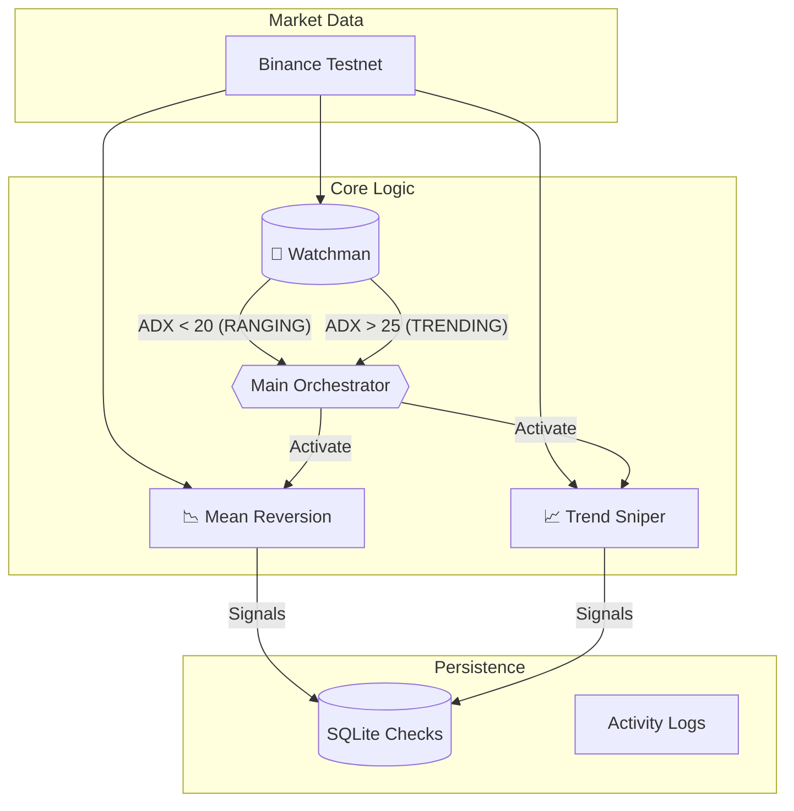

# 🤖 Hybrid Regime-Switching Trading Bot

A robust, modular algorithmic trading bot designed for crypto markets. It automatically switches between **Mean Reversion** and **Trend Following** strategies based on the market regime detected by ADX.


---

## 🧠 Architecture Overview

The bot uses a "Watchman" module to constantly monitor market conditions (Volatile vs Trending) and activates the appropriate strategy while pausing the other.



## ✨ Key Features

1.  **Hybrid Regime Detection**:
    *   Uses **ADX (Average Directional Index)** to classify market state.
    *   **Hysteresis Logic**: Prevents "whipsaw" switching (e.g., must cross 25 to start trending, must drop below 20 to stop).
    *   **Cooldown**: Enforces a 15-minute pause after regime changes to let volatility settle.

2.  **Dual Strategy Engine**:
    *   **Mean Reversion**: Active in sideways markets. Buys oversold (RSI < 30) at Bollinger Low, Sells overbought.
    *   **Trend Sniper**: Active in strong trends. Breakout entries using Donchian Channels ensuring alignment with EMA(200).

3.  **Robust Engineering**:
    *   **Dockerized**: Ready for cloud deployment.
    *   **Resilient**: Exponential backoff for network errors.
    *   **Safe**: `DRY_RUN` mode for paper trading without real risk.
    *   **Persisted**: All trades recorded in SQLite with full PnL tracking.

---

## 🚀 Getting Started

### Prerequisites
*   Python 3.12+ OR Docker
*   A Binance Account (Indices/Testnet API keys recommended)

### 1️⃣ Installation

Clone the repository:
```bash
git clone <repo-url>
cd typhoon-rebirth
```

### 2️⃣ Configuration

Copy the example environment file:
```bash
cp .env.example .env
```

Edit `.env` and fill in your details:
```ini
# Exchange Keys (Use Testnet for safety!)
EXCHANGE_API_KEY=your_key_here
EXCHANGE_SECRET=your_secret_here
EXCHANGE_SANDBOX=true

# Trading Settings
TRADING_PAIR=BTC/USDT
POSITION_SIZE_PERCENT=5
DRY_RUN=true  # Set to false only when ready for real money
```

### 3️⃣ Run Locally
Install dependencies and run:
```bash
pip install -r requirements.txt
python main.py
```

### 4️⃣ Run with Docker (Recommended)
Build and start the container in the background:
```bash
docker-compose up -d --build
```
View logs:
```bash
docker-compose logs -f
```

---

## 📊 Performance Analysis

The project includes a standalone tool to analyze your trading metrics (Winrate, Max Drawdown, Profit Factor).

**Run Analysis:**
```bash
# If running locally
python -m src.analysis_tool

# If running in Docker
docker-compose exec trading-bot python -m src.analysis_tool
```

**Output Example:**
```text
============================================================
  Mean Reversion Strategy
============================================================
  Total Trades:    42
  Winrate:         68.50%
  Profit Factor:   1.45
  Total PnL:       $124.50
```

---

## 📁 Project Structure

```
├── src/
│   ├── config.py           # Configuration loader
│   ├── database.py         # SQLite storage handler
│   ├── exchange_client.py  # CCXT Wrapper
│   ├── watchman.py         # Regime Detection Logic
│   ├── analysis_tool.py    # Performance Metrics
│   └── strategies/
│       ├── mean_reversion.py
│       └── trend_follower.py
├── main.py                 # Application Entry Point
├── Dockerfile              # Container definition
└── docker-compose.yml      # Service orchestration
```

---

## ⚠️ Disclaimer

This software is for educational purposes. Cryptocurrency trading involves high risk. **Use at your own risk.** The authors are not responsible for financial losses.
